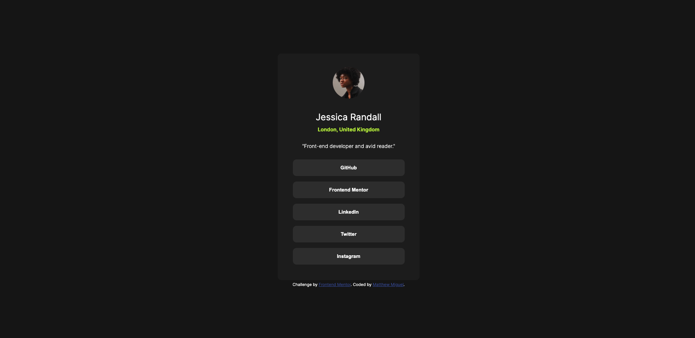

# Frontend Mentor - Social links profile solution

This is a solution to the [Social links profile challenge on Frontend Mentor](https://www.frontendmentor.io/challenges/social-links-profile-UG32l9m6dQ). Frontend Mentor challenges help you improve your coding skills by building realistic projects. 

## Table of contents

- [Overview](#overview)
  - [The challenge](#the-challenge)
  - [Screenshot](#screenshot)
  - [Links](#links)
- [My process](#my-process)
  - [Built with](#built-with)
  - [What I learned](#what-i-learned)
  - [Continued development](#continued-development)
  - [Useful resources](#useful-resources)
- [Author](#author)

## Overview

### The challenge

Users should be able to:

- See hover and focus states for all interactive elements on the page

### Screenshot

### Links

- Solution URL: [Add solution URL here](https://your-solution-url.com)
- Live Site URL: [Add live site URL here](https://your-live-site-url.com)

## My process

### Built with

- Semantic HTML5 markup
- CSS custom properties
- Flexbox

### What I learned

I applied what I learned in previous challenges to do this one faster. New thing I learned was how to change the cursor on a hover state.

### Continued development

Get better with layout and spacing. still takes some time for me to do it.

### Useful resources

- [How to change cursor](https://developer.mozilla.org/en-US/docs/Web/CSS/cursor) - Resource for how to change cursor in css

## Author

- Frontend Mentor - [@MattJM1007](https://www.frontendmentor.io/profile/MattJM1007)

